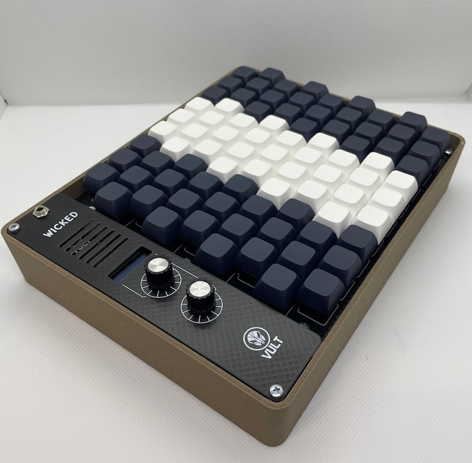

# Wicked

Wicked is a MIDI controller using the [Wicki-Hayden](https://en.wikipedia.org/wiki/Wicki%E2%80%93Hayden_note_layout) layout. This project was inspired by the [Melodicade MX by KOOP Instruments](https://www.koopinstruments.com/instrument-projects/melodicade-mx).

You can read more about this project here: https://www.vult-dsp.com/post/wicked-keys

**Important**

This repository contains the first revision I made which was a quick prototype. The basic controller works fine, but some things can be improved. I have not had time to do the changes, but help is welcome if anyone wants to contribute.

## Build Notes

- The project requires two PCBs. One is used for the top layer of the switches (the mechanical switches) and the bottom contains the push switches.
- The PCBs have 1.0 mm thickness instead of the more common 1.6 mm.
- Since the PCBs are thin and big, it is necessary to use standoffs to avoid bending them when pressing keys.
- The Teensy board is placed in the bottom board.
- The mechanical switches are cut in the bottom so the plunge can be used to press the bottom switch. See the Step 7 in the build notes of the [Melodicade MX](https://www.koopinstruments.com/instrument-projects/melodicade-mx).
- It is recommended to use spacers between the top and bottom boards.
- The screws in-between the switches need to be placed before the switches are soldered otherwise they won't fit.
- Do not solder directly the Teensy board, use headers.

## Improvements that I would like to make

- The Teensy 4.1 is much more powerful than needed. It would be nice to replace it by a cheaper alternative like th RPi Pico.
- The top and bottom boards are connected using flat cable. It would be nice to have some kind of low profile connector (1 mm high) to connect the boards.
- The board was initially designed to use the Teensy 3.6 DAC. Since the 3.6 is discontinued, the PWM output of the 4.1 is used. However, it's not very good for as CV or audio output. The op-amp stages can be removed or replaced by a better CV + Gate output.
- Features like DIN MIDI output or input are not included in the PCB. I had to manually solder the wires to pins 52 and 53 of the Teensy 4.1 (see the code).
- In the prototype I made I added a battery module from Adafruit that way the controller can be used without USB power.

## License

The whole project (code and design files) are released under the Creative Commons license CC BY-NC-SA. This imposes the following restrictions:

- BY: Credit must be given to the creator.
- NC: Only noncommercial uses of the work are permitted.
- SA: Adaptations must be shared under the same terms.
